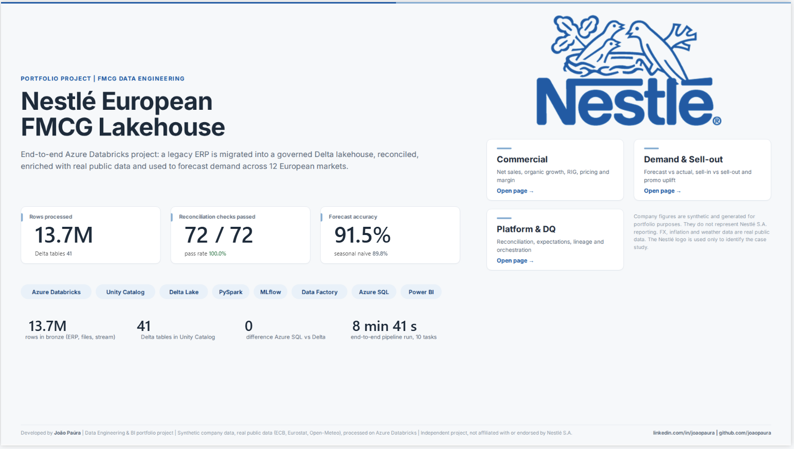
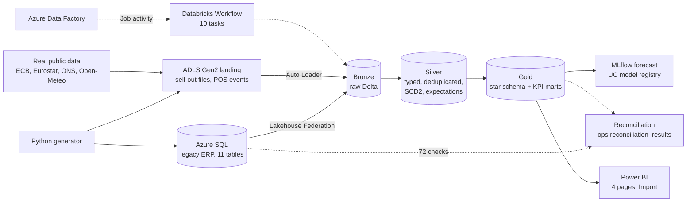
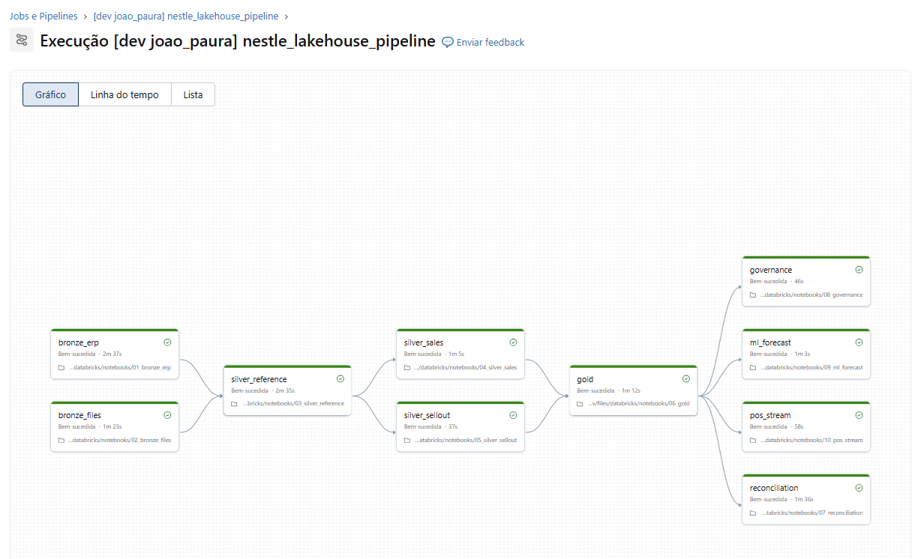
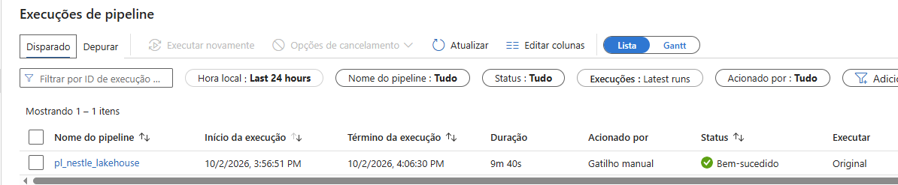
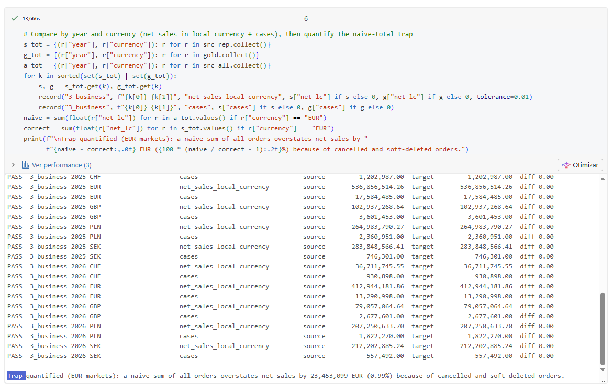
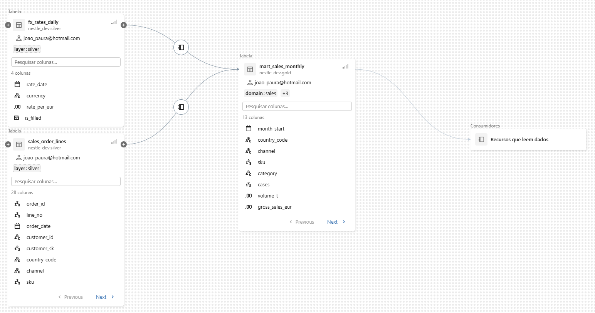
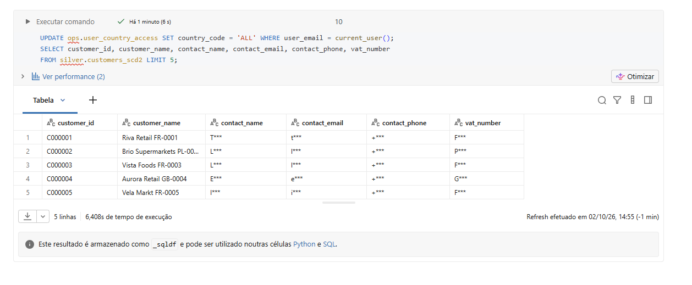
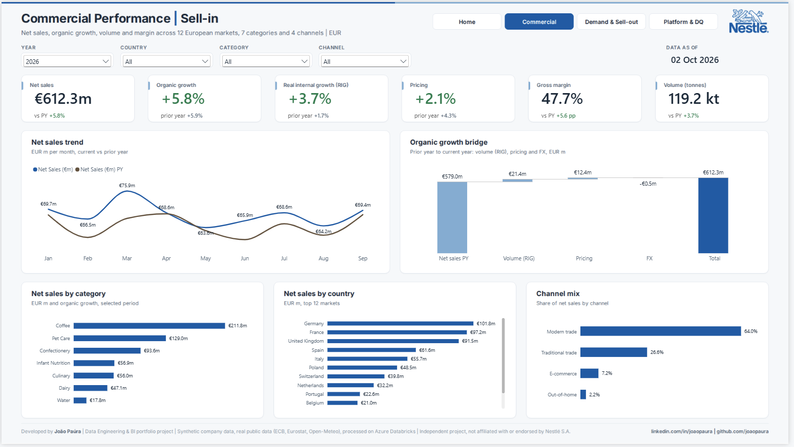
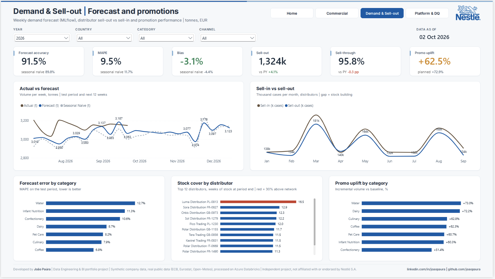
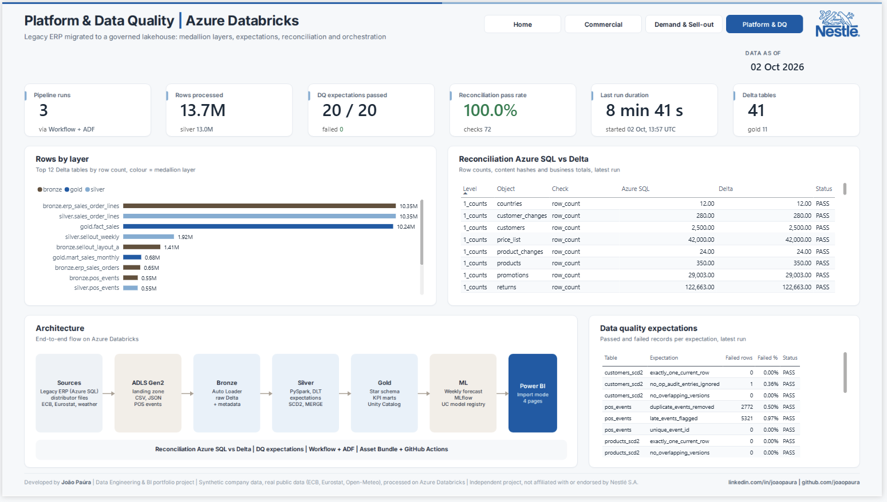

# Nestlé | European FMCG Lakehouse on Azure Databricks

> End-to-end data engineering project on **Azure Databricks**. A legacy ERP in **Azure SQL** is migrated into a governed **Delta lakehouse** (Unity Catalog, bronze / silver / gold), reconciled against the source with 72 automated checks, enriched with **real public data** (ECB FX, Eurostat food inflation, Open-Meteo weather), used to forecast weekly demand with **MLflow**, orchestrated by a Databricks Workflow and **Azure Data Factory**, deployed with an **Asset Bundle** and served in a 4-page **Power BI** report.

**[Open the live dashboard (Power BI)](https://app.powerbi.com/view?r=eyJrIjoiMDU3YmQxYzktYzI4NC00MzIxLWEwY2QtN2E1YmY5N2NiMzdmIiwidCI6ImRlODdjNWRjLTBhMzctNDVlMi1hNzhhLTM3NDg0ODE0MDNiZiJ9)**

> **Disclaimer:** independent portfolio project, not affiliated with or endorsed by Nestlé S.A. Company figures are synthetic and generated in Python. FX, inflation and weather data are real public data. The Nestlé logo is used only to identify the case study.



---

## At a glance

| | |
|---|---|
| **Business case** | Sell-in of a European FMCG organisation, Jan 2022 to Sep 2026: 12 markets, 5 currencies, 7 categories, ~350 SKUs, ~2,500 customers, 4 channels |
| **Data volume** | **13.7M rows** in bronze: 11 ERP tables (10.35M order lines), 1.96M distributor sell-out rows in **3,480 dirty files** (3 layouts, CSV and JSON), 548k POS events, real public data |
| **Lakehouse** | **41 Delta tables** in Unity Catalog (`nestle_dev`: bronze, silver, gold, ops, ml), Auto Loader, `MERGE`, SCD2 rebuilt from ERP audit logs, liquid clustering |
| **Migration** | Lakehouse Federation reads Azure SQL directly. **72 / 72 reconciliation checks pass**: row counts, content hashes (`xxhash64`) and 50 business totals by year and currency |
| **Data quality** | 20 expectations per run written to `ops.dq_results`, rejected sell-out rows kept with a reason in `ops.sellout_rejected` |
| **Governance** | Row-level security by country (data-driven row filter), PII column masks, tags, comments, grants, lineage |
| **Machine learning** | Direct 12-week demand forecast (HistGradientBoosting), tracked in MLflow, registered in Unity Catalog. **Accuracy 91.5%** vs 89.8% for the seasonal naive baseline |
| **Orchestration** | Databricks Workflow with 10 serverless tasks (**~9 minutes** end to end), triggered manually and from an **ADF** pipeline |
| **CI/CD** | Databricks Asset Bundle (`databricks.yml`), GitHub Actions: pytest, syntax checks, bundle validate |
| **Power BI** | 4 pages, Import from a Databricks SQL warehouse, 82 DAX measures, model and report written as code (TMDL + PBIR) |

## Stack

`Azure Databricks` `Unity Catalog` `Delta Lake` `PySpark` `Spark SQL` `Auto Loader` `Lakehouse Federation` `MLflow` `Azure SQL Database` `ADLS Gen2` `Azure Data Factory` `Databricks Asset Bundles` `GitHub Actions` `Python` `Power BI` `DAX`

## Architecture



## Pipeline (Databricks Workflow, deployed with the Asset Bundle)



| Task | Notebook | What it does | Time |
|---|---|---|---:|
| bronze_erp | `01_bronze_erp.py` | Snapshot of the 11 ERP tables through the federated catalog `erp_legacy_catalog` | 2m 38s |
| bronze_files | `02_bronze_files.py` | Auto Loader (`availableNow`) for 3 sell-out layouts and public data, schema hints, rescued data | 1m 23s |
| silver_reference | `03_silver_reference.py` | Countries and aliases, SCD2 customers and products rebuilt from audit logs, FX forward-filled, inflation, weather | 2m 36s |
| silver_sales | `04_silver_sales.py` | Order lines with point-in-time SCD2 join, daily FX and standard cost, `CLUSTER BY order_date` | 1m 06s |
| silver_sellout | `05_silver_sellout.py` | 3 layouts unified, country spellings mapped, rejects with reason, deduplication | 37s |
| gold | `06_gold.py` | Dimensions, facts and KPI marts (organic growth at constant FX, sell-in vs sell-out, promotions, demand) | 1m 13s |
| governance | `08_governance.sql` | Row filter, column masks, tags, grants (re-applied after each gold rebuild) | 47s |
| reconciliation | `07_reconciliation.py` | Azure SQL vs Delta: counts, hashes, business totals | 1m 36s |
| ml_forecast | `09_ml_forecast.py` | Train, evaluate against a baseline, log to MLflow, register the model | 1m 03s |
| pos_stream | `10_pos_stream.py` | Incremental POS events, schema evolution (new `device` field), late events, `foreachBatch` MERGE | 58s |



## Highlights

### Organic growth bridge (Jan to Sep, gold layer)

Net sales are converted at daily ECB rates. Organic growth uses local currency at the 2022 average rate, so currency moves are separated from real growth.

| Year | Net sales (EUR m) | Organic growth | RIG (volume) | Pricing | FX effect |
|---|---:|---:|---:|---:|---:|
| 2023 | 512.3 | +12.4% | -0.8% | +13.2% | -0.4% |
| 2024 | 544.5 | +5.3% | +0.8% | +4.5% | +1.0% |
| 2025 | 579.0 | +5.9% | +1.7% | +4.3% | +0.4% |
| 2026 | 612.3 | +5.8% | +3.7% | +2.1% | -0.1% |

The story matches the real food sector: inflation-led pricing in 2023, volume recovery in 2025 and 2026.

### Migration reconciliation



All 72 checks pass. The notebook also shows the **trap** a naive migration falls into: summing all orders, including cancelled and soft-deleted ones, overstates EUR net sales by **EUR 23.5M (0.99%)**.

### Governance

| Feature | Implementation |
|---|---|
| Row-level security | `ops.rf_country` on gold sales tables, driven by `ops.user_country_access` (a Poland manager only sees PL) |
| Column masking | `ops.mask_pii` on contact name, email, phone and VAT number in silver (`T***`), unmasked for `ops.pii_readers` |
| Lineage | Captured by Unity Catalog from the ERP to the Power BI marts |

| | |
|---|---|
|  |  |

### Demand forecast (MLflow)

| Model | WAPE | MAPE | Bias |
|---|---:|---:|---:|
| HistGradientBoosting, direct 12-week horizon | **8.45%** | **9.45%** | -3.08% |
| Seasonal naive (same week last year) | 10.23% | 11.74% | -4.44% |

Features use only information available 12 weeks ahead (lags of 12+ weeks, lag 52, climatological temperature, planned promotions), so there is no leakage. Water is the hardest category (weather driven), Coffee the easiest.

## Power BI report (4 pages)

| Page | Content |
|---|---|
| **Home** | Project summary, live platform KPIs, navigation |
| **Commercial Performance** | Net sales, organic growth, RIG, pricing, gross margin, volume vs prior year (same months); organic growth bridge; category, country and channel mix |
| **Demand & Sell-out** | Forecast accuracy, MAPE and bias vs baseline; actual vs forecast; sell-in vs sell-out; stock cover by distributor (overstock flagged); promotion uplift vs plan |
| **Platform & Data Quality** | Pipeline runs, rows processed, expectations, reconciliation, last run duration, rows by layer, architecture |

| | |
|---|---|
|  |  |



The model and report are generated by Python scripts (`powerbi/build/`) on top of a PBIP saved from Power BI Desktop, so every measure, relationship and visual is versioned as text.

## Repository structure

```
generator/            Python generator (synthetic ERP, dirty distributor files, POS events) + real public data download
sql/                  Azure SQL legacy ERP schema and read-only login for Databricks
infra/                ERP load into Azure SQL (pyodbc), upload to ADLS (Azure CLI)
databricks/notebooks/ 00 to 10: Unity Catalog setup, bronze, silver, gold, reconciliation, governance, ML, streaming
databricks.yml        Asset Bundle: 10-task serverless job
adf/                  Azure Data Factory pipeline (Databricks Job activity)
tests/                pytest for the generator
.github/workflows/    CI: pytest, syntax checks, bundle validate
powerbi/              PBIP project, build scripts, theme, logo, backgrounds
docs/                 Scope and screenshots
```

## How to reproduce

1. `pip install -r generator/requirements.txt`, then `python generator/download_public.py` and `python generator/run_all.py` (~13.7M rows)
2. Azure: SQL database (free offer), ADLS Gen2 account with `landing` and `lakehouse` containers, Databricks workspace (Premium) with an access connector
3. Load the ERP with `python infra/load_erp_to_sql.py` and the files with `infra/upload_landing.ps1`
4. Run `00_setup_unity_catalog.sql` and create the Lakehouse Federation connection to Azure SQL
5. `databricks bundle deploy` and `databricks bundle run nestle_lakehouse_pipeline`
6. Open `powerbi/Nestle_FMCG_Lakehouse.pbip`, point it to your SQL warehouse and refresh

## Lessons learned

- **Free trial limits:** the Azure free subscription has 3 vCPUs per region and no quota increase, so classic clusters were impossible. Everything runs on **serverless** compute.
- **Federation over copy:** reading Azure SQL through Lakehouse Federation removed a separate extract step and made the reconciliation a simple SQL comparison.
- **Schema evolution:** a new field in the POS events stopped the stream with `addNewColumns`. Switching to `rescue` mode and promoting the field from `_rescued_data` kept the stream running.
- **Policies and CREATE OR REPLACE:** recreating a gold table drops its row filter and masks, so governance is a task that runs after gold in every run.
- **Public data changes:** Eurostat moved HICP to a new ECOICOP dataset in 2026 and froze the old one. The download falls back between datasets and checks the last month.
- **Honest metrics:** the forecast is always compared with a seasonal naive baseline, not reported alone.

---

Developed by **João Paúra** | [LinkedIn](https://linkedin.com/in/joaopaura) | [GitHub](https://github.com/joaopaura)
